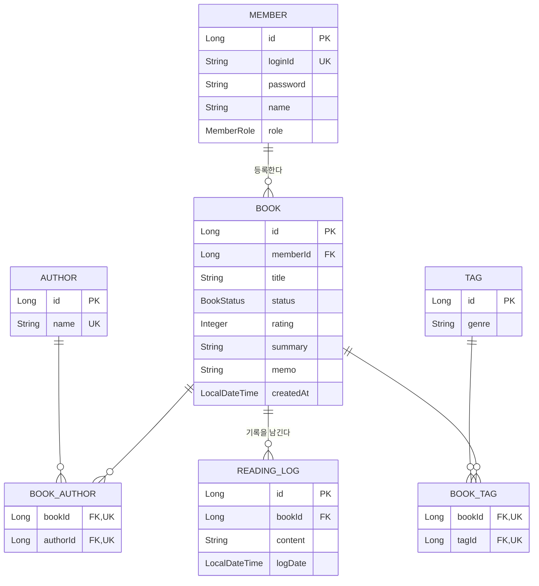

## 📚 BookLog

> **책을 넘어, 읽은 경험과 생각을 기록하는 독서 회고 플랫폼**

Spring Boot와 Thymeleaf를 기반으로 개발한 개인 독서 기록 및 서재 관리 웹 애플리케이션입니다.

단순 CRUD 구현에 그치지 않고, 프로젝트를 단계적으로 확장하며  
**Spring MVC → 세션 기반 인증 → JPA/MySQL → 관계형 데이터 모델링**까지 학습하고 적용했습니다.

---

## 📂 프로젝트 아카이브 (Document)

기능 명세서와 개발일지, 최종 결과 화면은 아래 문서에서 확인하실 수 있습니다.

* [📝 v2.0 스펙 명세서 & 개발 일지 보러가기](docs/v2/requirements-v2.md)
* [🖼️ v2.0 최종 릴리즈 결과 화면](docs/v2/screenshots-v2.md)

---
## 🎯 프로젝트 소개

BookLog는 사용자가 자신의 독서 기록을 관리하고 책에 대한 생각을 지속적으로 기록할 수 있는 서비스입니다.

초기에는 메모리 기반 CRUD 애플리케이션으로 시작했으며,  
기능 확장 과정에서 데이터 영속성과 관계형 데이터 모델의 필요성이 증가하여
JPA와 MySQL 기반 구조로 전환했습니다.

현재는 다음과 같은 도메인 구조를 갖추고 있습니다.

> 회원(Member)은 여러 권의 도서(Book)를 소유하며, 각 도서는 여러 저자(Author)·태그(Tag)와 다대다로 연결됩니다.
> 독서기록(ReadingLog)은 회원이 아닌 도서에 직접 연결되어, 특정 책에 대한 기록만 누적되도록 설계했습니다.
---

## 🛠️ 기술 스택
### Backend
- Java 21
- Spring Boot 4.1.0
- Spring MVC
- Spring Data JPA
- Spring Validation
- Hibernate
### Database
- MySQL
### Frontend
- Thymeleaf
- HTML / CSS
### Build & Development
- Gradle
- IntelliJ IDEA
- Git / GitHub

---

## ✨ 주요 기능
👤 회원 및 인증
- 로그인 / 로그아웃
- HTTP Session 기반 인증
- Interceptor를 통한 로그인 사용자 접근 제어
- @LoginMember + ArgumentResolver를 이용한 로그인 사용자 주입
- 회원별 자신의 도서 데이터만 조회 / 수정 / 삭제

📚 도서 관리
- 도서 등록 / 조회 / 수정 / 삭제
- 독서 상태 관리
  - WISH
  - READING
  - DONE
- 평점 및 독서 메모 관리
- 도서 검색
- 정렬
- 사용자별 서재 관리

✍️ 독서 기록
- 하나의 도서에 여러 독서 기록 저장
- 독서 기록 작성 시간 관리
- 누적된 독서 경험을 ReadingLog로 분리

🏷️ 도서 분류
- 도서와 저자의 N:M 관계
- 도서와 태그의 N:M 관계
- 하나의 도서에 여러 저자 등록 가능
- 하나의 도서에 여러 태그 등록 가능

---

### 🗺️ 프로젝트 마일스톤 (Milestones)
🌱 [v1.x | Spring MVC 기반 CRUD](docs/v1/requirements-v1.md)
- 도서 CRUD
- 검색 / 정렬 / 페이징
- Validation
- Thymeleaf 기반 UI

🔒 [v2.x | 세션 기반 인증 및 사용자 기능](docs/v2/requirements-v2.md)
- 회원가입 / 로그인
- Session 기반 인증
- Interceptor
- 사용자별 서재
- 사용자별 데이터 접근 제어

💾 [v3.0 | JPA 및 관계형 데이터 모델링](docs/requirements-v3.md) (작성 예정)
- Spring Data JPA 적용
- MySQL 전환
- Repository를 JpaRepository 기반으로 전환
- Service 트랜잭션 적용
- Author 엔티티 분리
- Book : Author N:M 관계 도입
- Tag 엔티티 및 Book : Tag N:M 관계 도입
- ReadingLog 도메인 추가
- 기존 Author 문자열 데이터 마이그레이션
