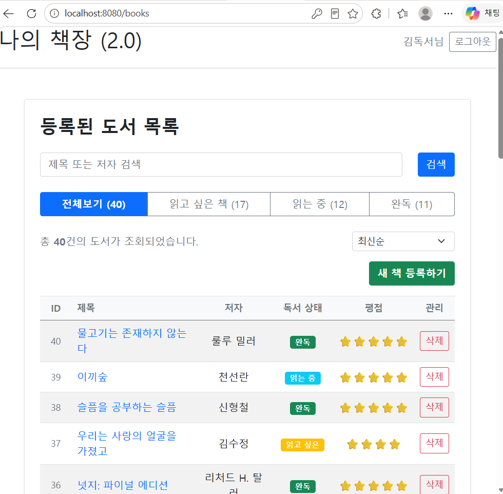
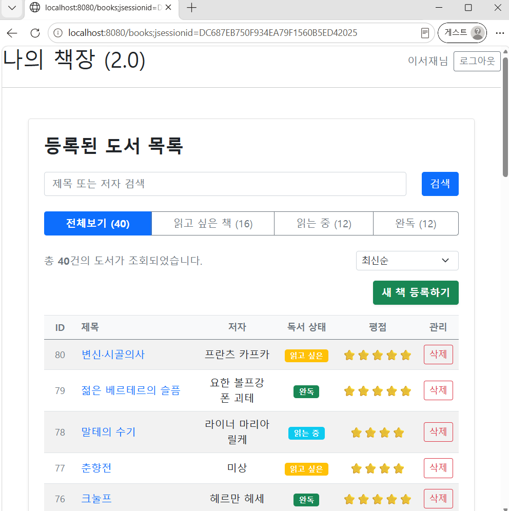
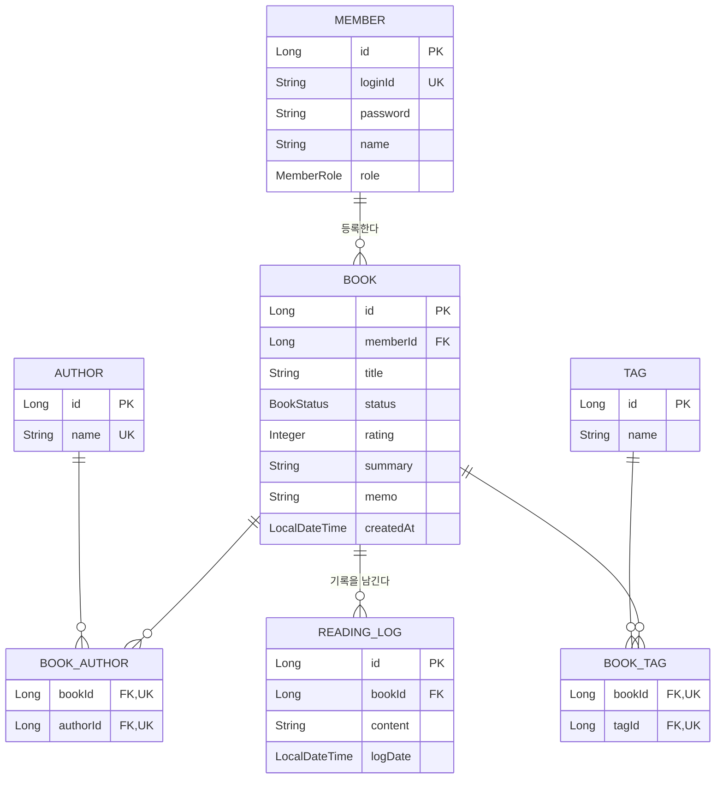

## 📚 BookLog

> **책을 넘어, 읽은 경험과 생각을 기록하는 독서 회고 플랫폼**

---

## 📸 미리보기

같은 `/books` 주소라도 로그인한 회원에 따라 완전히 다른 서재가 조회됩니다 — 세션 기반 인증과 회원별 데이터 격리가 적용된 결과입니다.

| 👤 user1로 로그인 | 👤 user2로 로그인 |
| :---: | :---: |
|  |  |

도서별 **검색·상태 필터·다중 정렬**과 **독서 상태별 통계 대시보드**도 함께 제공됩니다. 
더 많은 화면은 아래 마일스톤의 결과 화면 문서에서 확인하실 수 있습니다.

---

## 🎯 프로젝트 소개

BookLog는 사용자가 자신의 독서 기록을 관리하고 책에 대한 생각을 지속적으로 기록할 수 있는 서비스입니다.

단순 CRUD 구현에 그치지 않고, 메모리 기반 애플리케이션으로 시작해
**Spring MVC → 세션 기반 인증 → JPA/MySQL → 관계형 데이터 모델링**
까지 단계적으로 확장하며 학습하고 적용한 성장형 포트폴리오입니다.

---
## ✨ 주요 기능

**👤 회원 및 인증**
- 로그인 / 로그아웃, HTTP Session 기반 인증
- Interceptor를 통한 로그인 사용자 접근 제어
- `@LoginMember` + ArgumentResolver를 이용한 로그인 사용자 주입
- 회원별 자신의 도서 데이터만 조회 / 수정 / 삭제 (IDOR 방지)

**📚 도서 관리**
- 도서 등록 / 조회 / 수정 / 삭제, 독서 상태(WISH / READING / DONE) 관리
- 평점 및 독서 메모 관리
- 제목·저자 검색, 다중 정렬, 독서 상태별 통계 대시보드

**✍️ 독서 기록**
- 하나의 도서에 여러 독서 기록을 누적 저장 (`ReadingLog`)
- 기록 작성 시간 자동 관리 (JPA Auditing)

**🏷️ 도서 분류**
- 도서 ↔ 저자, 도서 ↔ 태그 N:M 관계로 한 책에 여러 저자·태그 등록 가능

---

## 🛠️ 기술 스택

**Backend**: Java 21, Spring Boot 4.1.0, Spring MVC, Spring Data JPA, Spring Validation, Hibernate
**Database**: MySQL
**Frontend**: Thymeleaf, HTML / CSS
**Build & Dev**: Gradle, IntelliJ IDEA, Git / GitHub

---

## 🗂️ ERD

---

## 🗺️ 프로젝트 마일스톤 (Milestones)
🌱 [v1.4 | Spring MVC 기반 CRUD](docs/v1/requirements-v1.md) ✅
- 도서 CRUD · 검색 / 정렬 · Validation · Thymeleaf 기반 UI
- [📝 개발일지](docs/v1/dev-log-v1.md) · [🖼️ 결과 화면](docs/v1/screenshots-v1.4.md)

🔒 [v2.0 | 세션 기반 인증 및 사용자 기능](docs/v2/requirements-v2.md) ✅
- 회원가입 / 로그인 · Session 인증 · Interceptor · 사용자별 서재 및 데이터 접근 제어
- [📝 개발일지](docs/v2/dev-log-v2.md) · [🖼️ 결과 화면](docs/v2/screenshots-v2.md)

💾 [v3.0 | JPA 및 관계형 데이터 모델링](docs/v3/requirements-v3.md)
- Spring Data JPA 적용, MySQL 전환, Repository JpaRepository 전환 ✅
- Author / Tag / ReadingLog 엔티티 및 N:M 관계 도입, 레거시 데이터 마이그레이션 ✅
- Query 최적화(N+1 해결) — 남은 작업
- [📝 개발일지](docs/v3/dev-log-v3.md)