# 🖼️ BookLog v1.4 최종 릴리즈 결과 화면 (Screenshots)

> v1.4 기준 BookLog의 주요 기능 및 최종 UI/UX 결과 화면을 정리합니다.
> v1.3에서 추가된 검색·필터·정렬 기능과 v1.4에서 추가된 Spring Validation 및 입력 오류 처리 기능을 포함합니다.

---

## 📊 1. 메인 대시보드 및 도서 목록

* **핵심 기능**: 도서 목록 조회 및 독서 상태별 통계 대시보드 제공.
* **검색 기능**: 제목 및 저자 기반 키워드 검색.
* **필터 기능**: `WISH`, `READING`, `DONE` 상태별 필터링.
* **정렬 기능**: 최신순, 오래된순, 제목순, 평점순 등 다양한 정렬 기준 지원.
* **UI 포인트**: Bootstrap 기반 테이블 및 상태별 컬러 배지를 활용하여 도서 상태를 직관적으로 표현.

### 🔗 전체 도서 목록

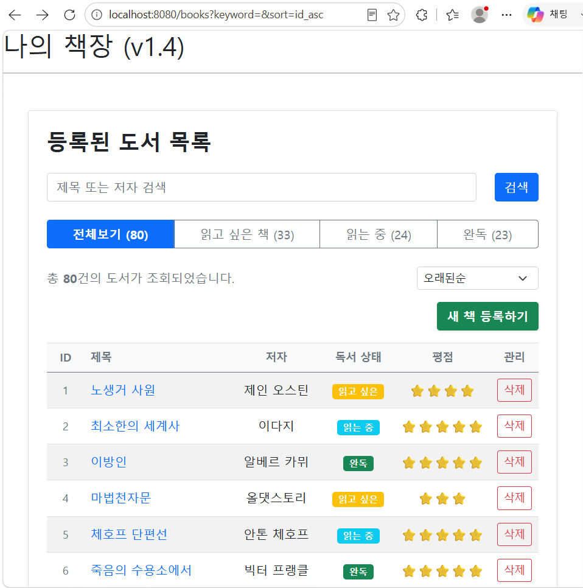

*전체 도서 목록과 독서 상태별 대시보드가 표시된 기본 화면*

---

## 🔍 2. 도서 검색 및 상태 필터링

* **검색 대상**: 도서 제목(`title`) 및 저자(`author`)
* **검색 조건**:
    * 대소문자를 구분하지 않는 키워드 검색.
    * 검색어(`keyword`)와 독서 상태(`status`)를 동시에 적용할 경우 두 조건을 모두 만족하는 도서만 조회.
* **상태 유지**: 검색 후에도 검색어가 유지되며 상태 필터를 변경할 수 있도록 구현.

| 🔎 키워드 검색 | 💚 검색 + 상태 필터 |
| :---: | :---: |
| 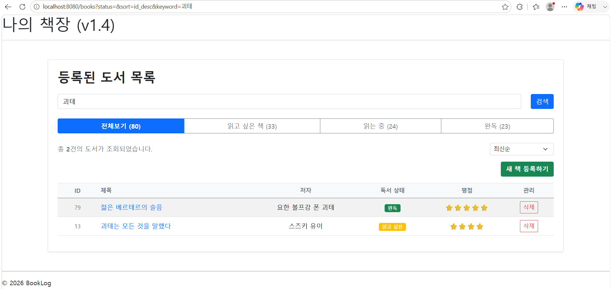 | 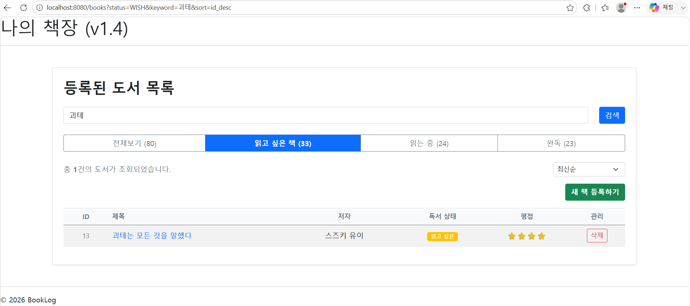 |
| *제목·저자 기반 키워드 검색* | *검색어와 독서 상태를 동시에 적용한 교집합 검색* |

---

## ↕️ 3. 도서 정렬 기능

* **지원 정렬 기준**:
    * ⏱️ 최신순 (`id_desc`)
    * ⏳ 오래된순 (`id_asc`)
    * 🔤 제목 오름차순 (`title_asc`)
    * 🔤 제목 내림차순 (`title_desc`)
    * ⭐ 평점 높은순 (`rating_desc`)
    * ⭐ 평점 낮은순 (`rating_asc`)
* **Null-Safety**: 평점이 없는 도서도 `Comparator.nullsLast()`를 적용하여 오류 없이 처리.
* **UI/UX**: 정렬 옵션 선택 즉시 목록을 갱신하여 별도의 검색 버튼 없이 결과 확인 가능.

| ⏱️ 최신순 |                      🔤 제목 내림차순                      |
| :---: |:----------------------------------------------------:|
| 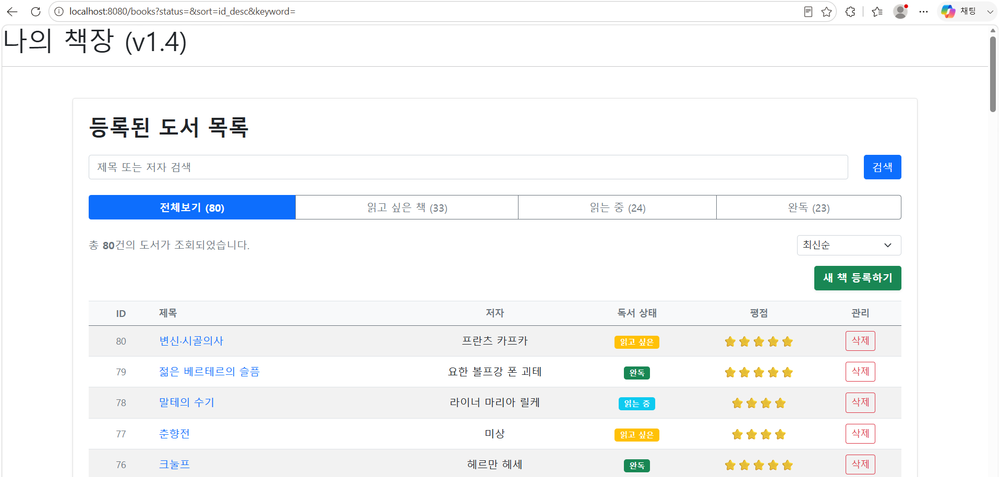 | 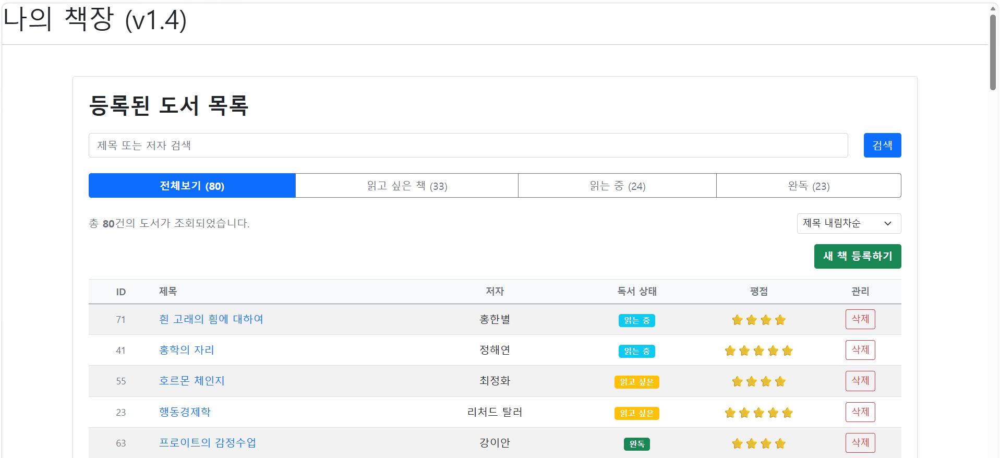 |
| *최신 등록 순으로 정렬된 목록* |                  *제목 내림차순으로 정렬된 목록*                  |

---

## 🔗 4. 검색 · 필터 · 정렬 조건 상태 유지

* **핵심 기능**: `keyword`, `status`, `sort` 세 가지 Query Parameter를 조합하여 검색 상태 유지.
* **동작 예시**:
    1. 키워드 검색
    2. 독서 상태 필터 적용
    3. 정렬 기준 변경
    4. 기존 검색 및 필터 조건을 유지한 상태로 결과 갱신

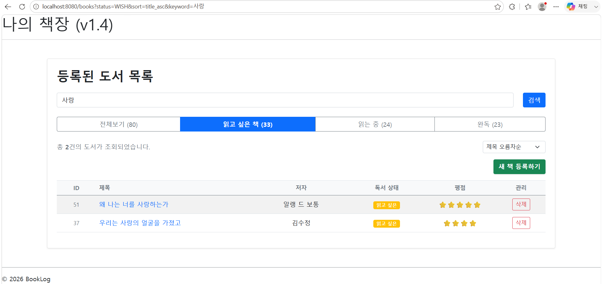

*검색어·상태 필터·정렬 조건을 동시에 적용한 최종 화면*

---

## 📝 5. 새 책 등록 및 입력 Validation

* **핵심 기능**: Spring Validation을 활용한 서버 측 입력값 검증.
* **검증 대상**:
    * 제목: 필수 입력, 최대 50자
    * 저자: 필수 입력, 최대 50자
    * 독서 상태: 필수 선택
    * 평점: 1~5점
    * 한줄평: 최대 100자
    * 메모: 최대 500자
* **UI 포인트**: `BindingResult`와 Thymeleaf의 `th:errors`, `th:errorclass`를 활용하여 필드별 오류 메시지 표시.

### ➕ 정상적인 새 책 등록 화면

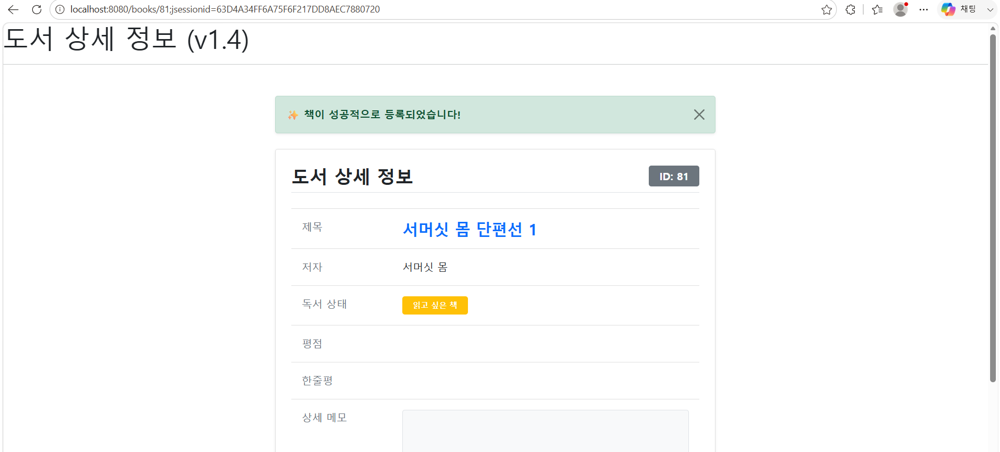

*새 책 등록을 위한 입력 폼*

### 🚨 Validation 오류 화면

| ❌ 필수값 누락 | 📏 입력 길이 초과 |
| :---: | :---: |
| 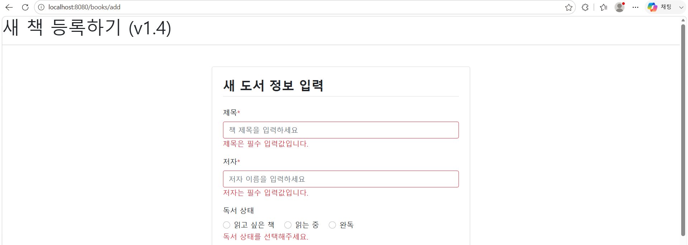 | 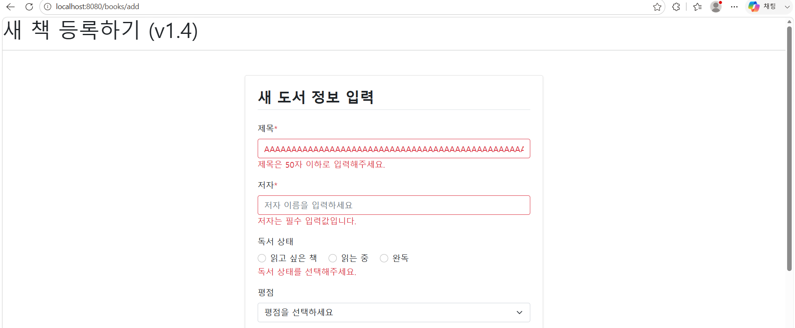 |
| *필수 입력값이 누락된 경우* | *최대 입력 길이를 초과한 경우* |

---

## ✏️ 6. 도서 정보 수정

* **핵심 기능**: 기존 도서 정보를 수정할 수 있는 편집 화면 제공.
* **기존 데이터 바인딩**: `BookForm`과 Thymeleaf `th:field`를 활용하여 기존 데이터를 수정 폼에 반영.
* **선택값 처리**:
    * 독서 상태는 기존 상태에 맞는 Radio Button 자동 선택.
    * 평점은 기존 평점에 맞는 항목 자동 선택.
    * 평점이 없는 경우 미선택 상태 유지.
* **Validation**: 등록과 동일한 검증 규칙을 수정 과정에도 적용.

| ✏️ 기존 데이터가 바인딩된 수정 화면 | 🚨 수정 과정 Validation |
| :---: | :---: |
| 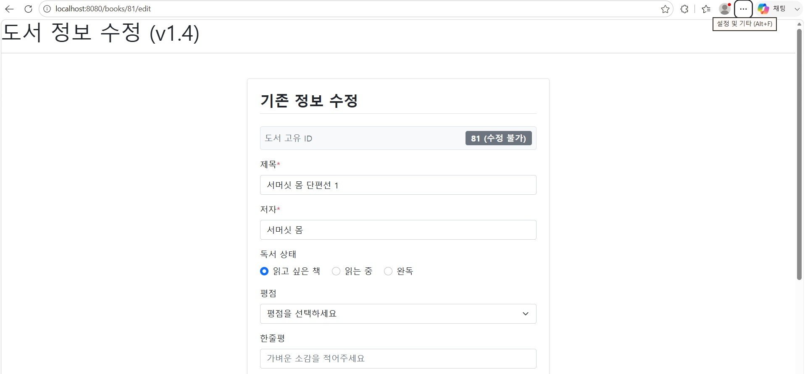 | 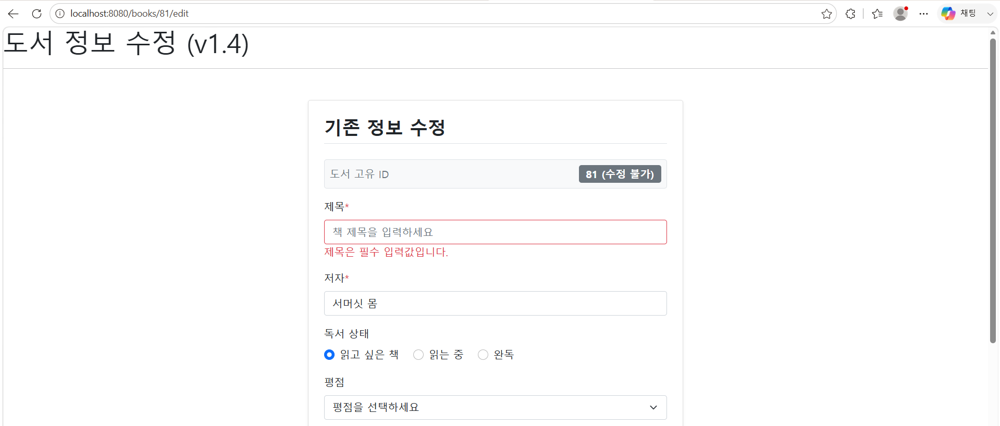 |
| *기존 도서 정보가 자동으로 입력된 수정 폼* | *잘못된 입력값에 대한 오류 메시지 표시* |

---

## 📌 v1.4 주요 기능 요약

| 기능 | 주요 구현 |
| :--- | :--- |
| 📊 도서 목록 | 전체 도서 조회 및 상태별 대시보드 |
| 🔍 검색 | 제목·저자 기반 키워드 검색 |
| 🏷️ 필터 | 독서 상태별 필터링 |
| ↕️ 정렬 | 최신순·오래된순·제목순·평점순 |
| 🔗 상태 유지 | `keyword`·`status`·`sort` Query Parameter 유지 |
| 📝 Validation | Spring Validation 기반 서버 검증 |
| 🚨 오류 표시 | `BindingResult` + Thymeleaf `th:errors` |
| 🔄 입력값 유지 | Validation 실패 시 기존 입력값 유지 |
| ✏️ 수정 | 기존 데이터 자동 바인딩 및 검증 |
| 🔀 PRG | 등록·수정 완료 후 상세 페이지 Redirect |
| 🚨 예외 처리 | 404/500 커스텀 에러 페이지 |

---

### 🔗 관련 문서 바로가기

* [📝 v1.4 스펙 명세서 & 개발 트래킹 보러가기](./requirements-v1.md)
* [🖼️ v1.2 최종 릴리즈 결과 화면 보러가기](./screenshots-v1.2.md)
* [🏠 메인 README로 돌아가기](../../README.md)