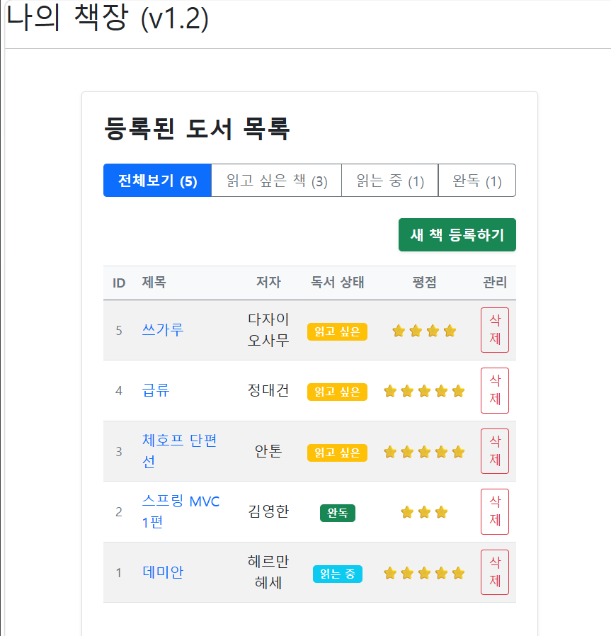
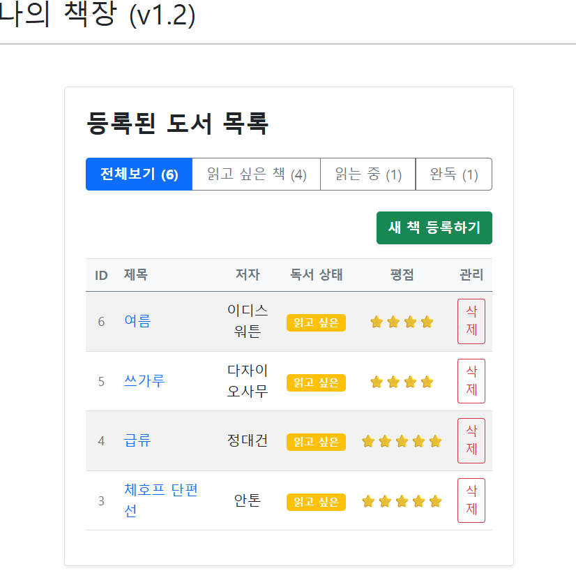
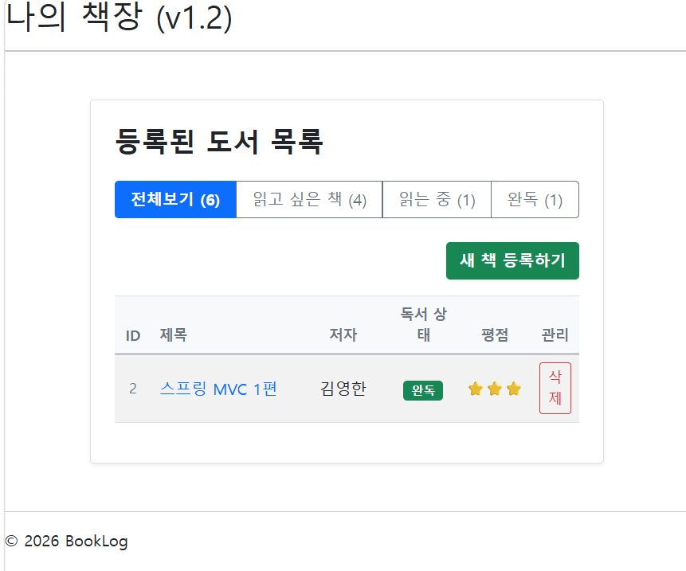
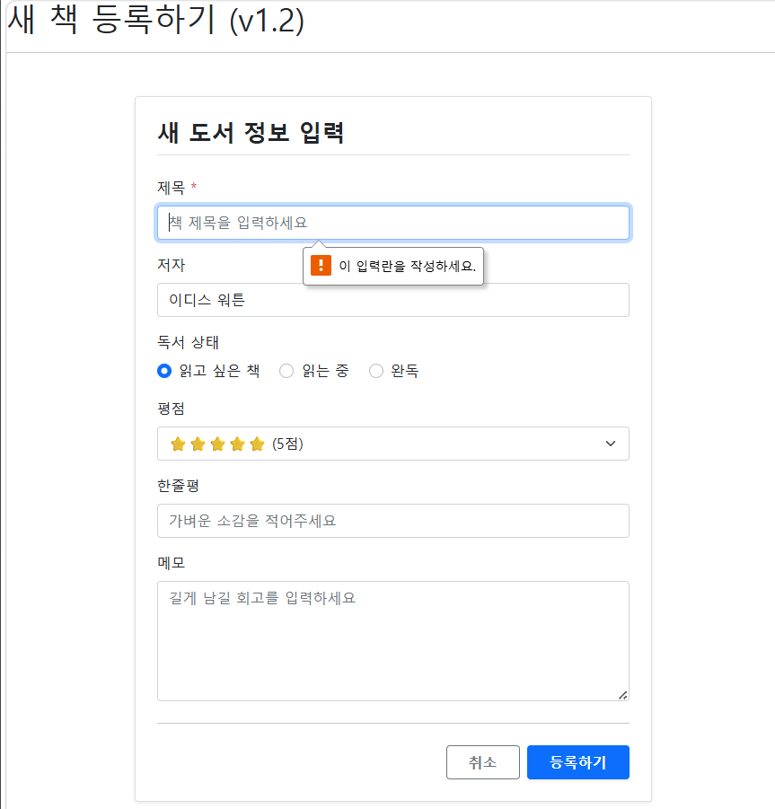
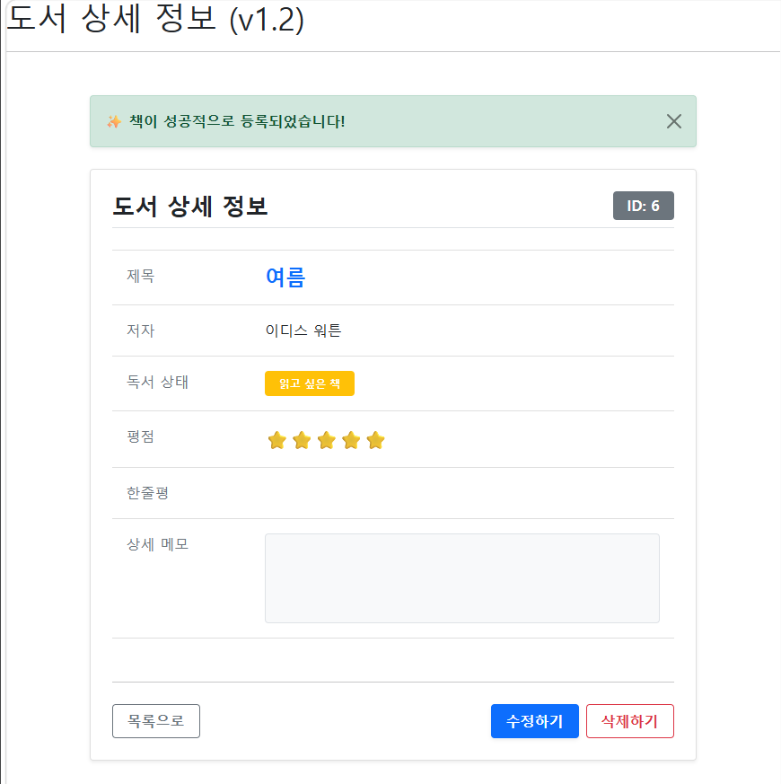
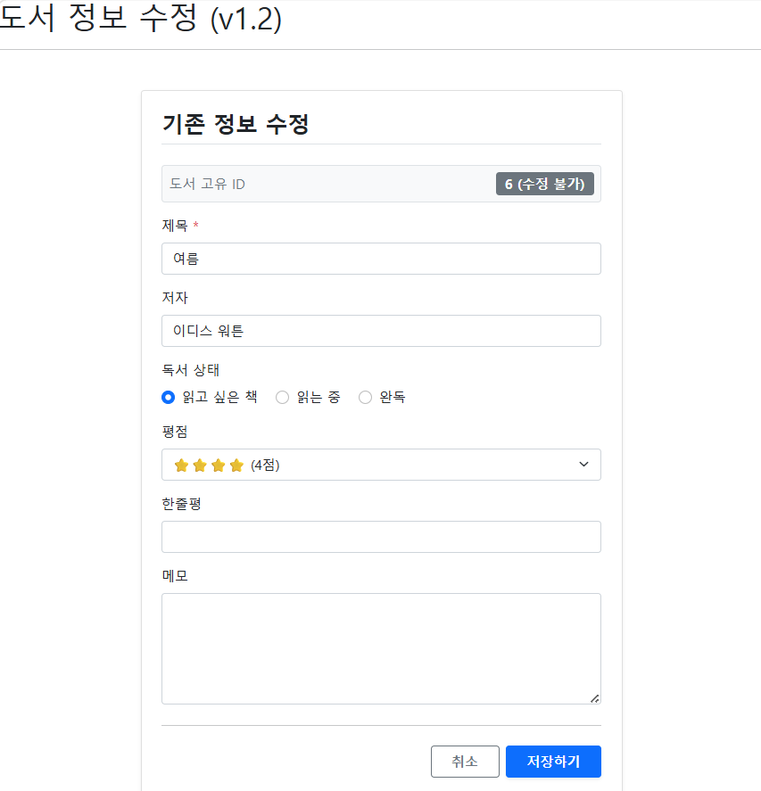
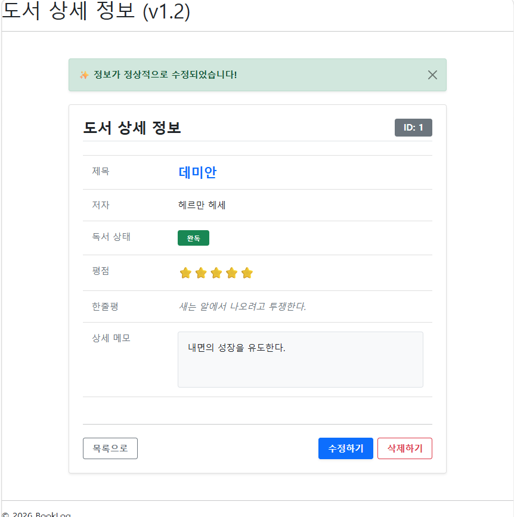
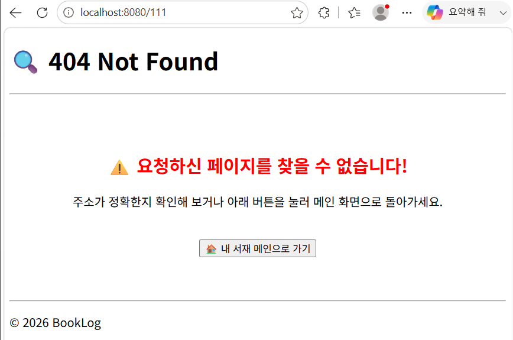
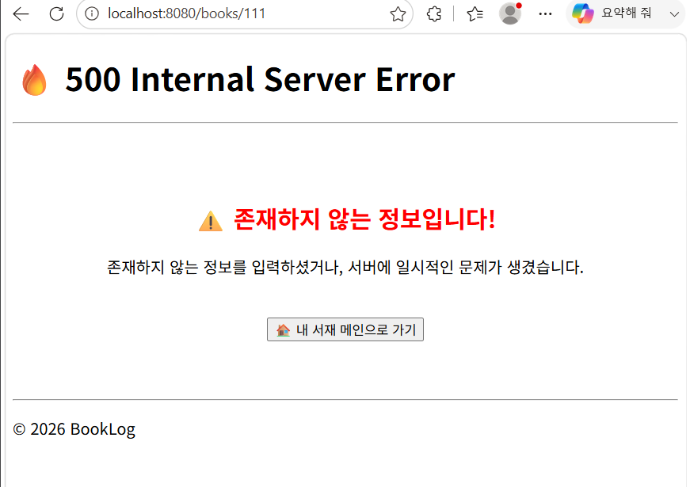

# 🖼️ BookLog v1.2 최종 릴리즈 결과 화면 (Screenshots)

> **순수 스프링 MVC 아키텍처 아카이빙 및 부트스트랩 UI 고도화 결과물입니다.**
> 이미지 경로가 올바르지 않을 경우, `docs/v1/images/` 폴더 내 파일명을 확인해 주세요.

---

### 📊 1. 메인 대시보드 및 도서 목록 (Main List)
* **핵심 기능**: `Stream API` 기반 독서 상태별 동적 카운팅 및 버튼 그룹 필터링 렌더링.
* **UI 포인트**: 부트스트랩 `table-hover` 및 상태별 컬러 배지(`badge`) 적용으로 시각적 피드백 강화.

#### 🔗 [전체보기] 기본 대시보드 화면

#### 🔍 독서 상태별 동적 필터링 작동 화면 (Filter View)
| 💛 읽고 싶은 책 필터링 (`WISH`) | 💚 완독 도서 필터링 (`DONE`) |
| :---: | :---: |
|  |  |
| *WISH 배지만 필터링되어 대시보드 활성화* | *DONE 배지만 필터링되어 대시보드 활성화* |

---

### 📝 2. 데이터 관리 및 트래킹 워크플로우 (Form & Detail)
* **좌 (새 책 등록)**: 필수값 검증 및 부트스트랩 `form-control` 기반의 깔끔한 입력 폼 레이아웃.
* **우 (도서 상세 조회)**: `addFlashAttribute`를 통해 배달된 일회성 성공 알림(Alert) 및 메모 컴포넌트 커스텀 스타일링.

| ➕ 새 책 등록하기 (`addForm.html`) | 📖 도서 상세 조회 (`book.html`) |
| :---: | :---: |
|  |  |
| *기존 테이블 구조를 탈피한 600px 슬림 카드 폼* | *상단 성공 알림 배너 및 정보 레이어 분리* |

---

### ✏️ 3. 도서 정보 수정 및 반영 워크플로우 (Edit Info)
* **핵심 기능**: 타임리프 `th:checked`, `th:selected` 문법을 활용한 기존 데이터 동적 바인딩 및 수정 처리.
* **UI 포인트**: 도서 고유 ID를 읽기 전용(`readonly`) 비활성화 배지 박스로 처리하여 오조작 방지.

| ✏️ 기존 정보 수정 폼 (`editForm.html`) | ✨ 수정 완료 알림 및 상세 조회 (`book.html`) |
| :---: | :---: |
|  |  |
| *기존 도서 데이터가 온전히 동적 바인딩된 화면* | *수정 완료 후 상세 페이지로 리다이렉트되어 Alert 노출* |

---

### 🚨 4. 예외 처리 및 방어막 구축 (Error Pages)
* **핵심 기능**: 잘못된 식별자 접근 및 서버 내부 예외 발생 시 톰캣 화이트라벨 에러 화면을 차단하고 커스텀 예외 UX 제공.

| 🔍 404 Not Found (페이지 없음) | 🔥 500 Internal Server Error (서버 오류) |
| :---: | :---: |
|  |  |
| *존재하지 않는 도서 ID 쿼리 시 대응* | *레포지토리 및 비즈니스 로직 예외 방어* |

---

### 🔗 관련 문서 바로가기
* [📝 v1.2 스펙 명세서 & 개발 트래킹 보러가기](./requirements-v1.md)
* [🏠 메인 README로 돌아가기](../../README.md)
---
### 🔗 관련 문서 바로가기
* [📝 v1.2 기능 명세서 & 개발 일지 보러가기](./specifications.md)
* [🏠 메인 README로 돌아가기](../../README.md)