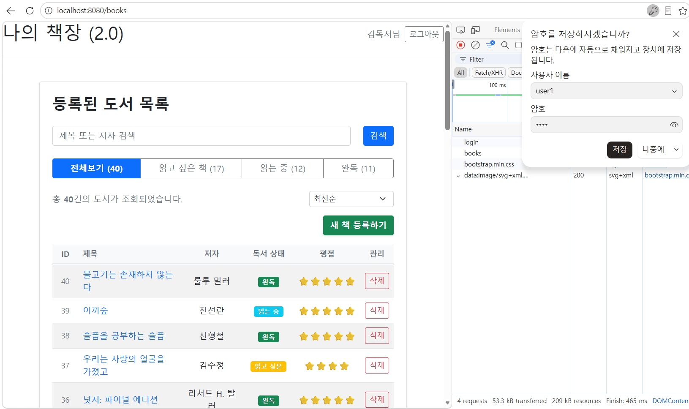
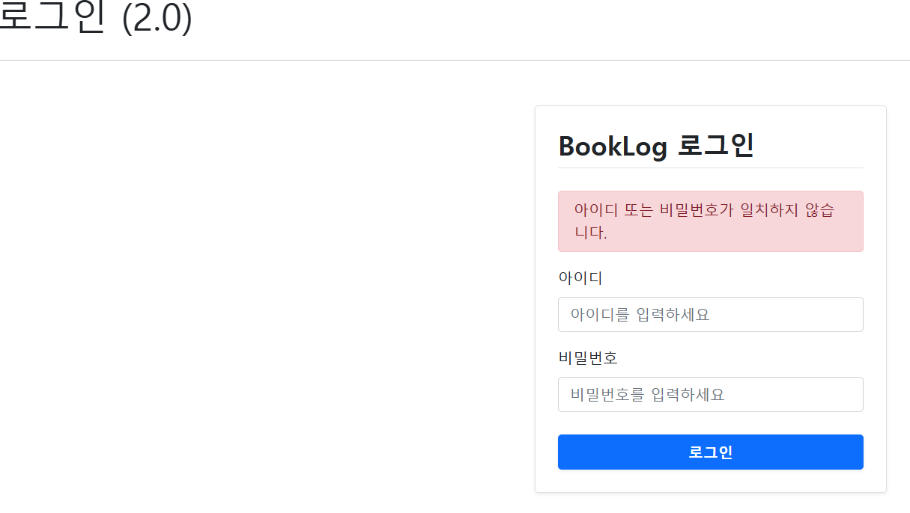
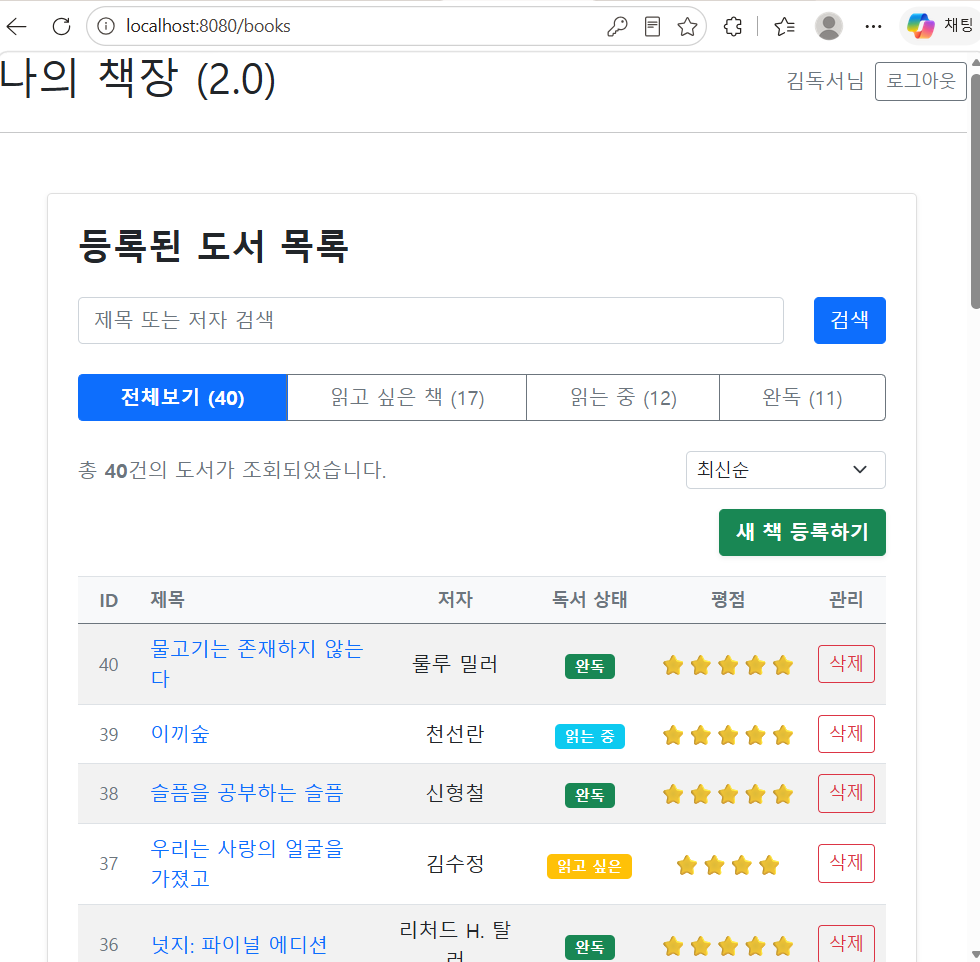
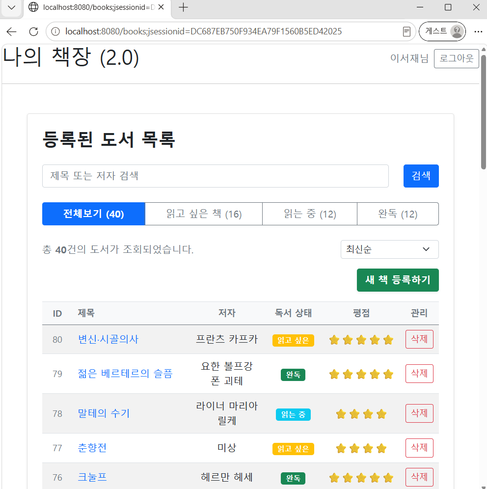
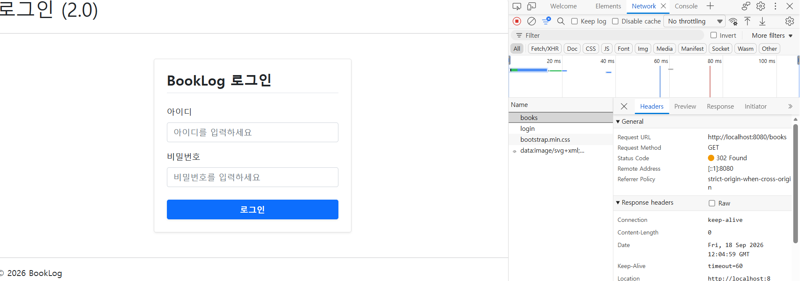
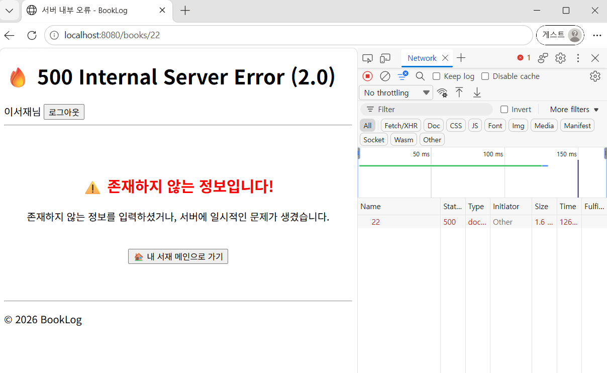

# 🖼️ BookLog v2.0 최종 릴리즈 결과 화면 (Screenshots)

> v2.0 기준 BookLog의 주요 기능 및 최종 UI/UX 결과 화면을 정리합니다.
> v2.0에서는 세션 기반 로그인/로그아웃과 회원별 서재 격리, 그리고 타인 소유 도서에 대한 접근 제어(IDOR 방지) 기능이 추가되었습니다.

---

## 🔐 1. 로그인 및 인증

* **핵심 기능**: `HttpSession` 기반 로그인/로그아웃 처리.
* **인증 실패 처리**: 아이디 또는 비밀번호 불일치 시 오류 메시지 표시 및 입력 화면 재노출.

| 🔑 정상 로그인 화면 | 🚨 로그인 실패 화면 |
| :---: | :---: |
|  |  |
| *아이디/비밀번호 입력 폼* | *아이디 또는 비밀번호가 일치하지 않는 경우* |

---

## 📚 2. 회원별 서재 격리 (핵심 기능)

* **핵심 기능**: 동일한 `/books` 화면이라도 로그인한 회원에 따라 완전히 다른 도서 목록이 조회됨.
* **검증 방식**: 서로 다른 두 계정(`user1`, `user2`)으로 각각 로그인하여, 같은 URL에서 서로 다른 결과가 반환되는지 직접 비교.
* **UI 포인트**: 목록 화면 자체는 v1.4와 동일한 구조를 재사용하되, 내부 조회 조건에 회원 식별자가 결합됨.

| 👤 user1의 서재 | 👤 user2의 서재 |
| :---: | :---: |
|  |  |
| *user1로 로그인했을 때 조회되는 도서 목록* | *user2로 로그인했을 때 조회되는, 완전히 다른 도서 목록* |

> 동일한 `localhost:8080/books` 주소에서 로그인 계정에 따라 서로 다른 결과가 반환됨을 확인할 수 있습니다.

---

## 🚧 3. 비로그인 접근 제어

* **핵심 기능**: `LoginCheckInterceptor`를 통해 비로그인 상태로 `/books/**` 경로 접근 시 로그인 화면으로 자동 리다이렉트.
* **검증 방식**: 로그아웃 상태에서 `/books` 주소를 주소창에 직접 입력하여 접근 시도.

*비로그인 상태로 `/books`에 접근을 시도했을 때, 주소창이 `/login`으로 리다이렉트된 화면*

---

## 🛡️ 4. 타인 소유 도서 접근 차단 (IDOR 방지)

* **핵심 기능**: 도서 상세/수정/삭제 요청 시 URL의 `bookId`뿐 아니라 로그인 회원의 소유권까지 함께 검증.
* **검증 방식**: `user2`로 로그인한 상태에서 `user1` 소유 도서의 `bookId`를 주소창에 직접 입력하여 접근 시도.
* **보안적 의미**: 단순히 회원별로 데이터를 나누는 것에서 그치지 않고, "존재하지만 본인 소유가 아닌 리소스"에 대한 URL 직접 접근(IDOR, Insecure Direct Object Reference)까지 차단함을 증명.

*user2로 로그인한 상태에서 user1 소유 도서의 ID: 22 로 직접 접근을 시도했을 때, 접근이 차단되는 화면*

---

## 📌 v2.0 주요 기능 요약

| 기능 | 주요 구현 |
| :--- | :--- |
| 🔐 로그인/로그아웃 | `HttpSession` 기반 인증, 세션 무효화 |
| 👤 회원 도메인 | `Member`, `MemberRepository`/`MemoryMemberRepository` |
| 📚 회원별 서재 | `Book`에 `memberId` 추가, `findAllByMemberId`/`findByIdAndMemberId` |
| 🧩 파라미터 주입 | `@LoginMember` + `HandlerMethodArgumentResolver`로 세션 접근 캡슐화 |
| 🚧 접근 제어 | `LoginCheckInterceptor`로 비로그인 `/books/**` 접근 차단 |
| 🛡️ 소유권 검증 | 수정/삭제/상세조회 시 소유권 선검증, 실패 시 예외 및 실제 변경 로직 미호출 |
| 🧪 테스트 | Service(Mockito) / Repository(Fake Object) 계층별 책임 분리 테스트 |

---

### 🔗 관련 문서 바로가기

* [📝 v2.0 스펙 명세서 보러가기](./requirements-v2.md)
* [🗺️ v2.0 개발 일지 보러가기](./dev-log-v2.md)
* [🖼️ v1.4 최종 릴리즈 결과 화면 보러가기](../v1/screenshots-v1.4.md)
* [🏠 메인 README로 돌아가기](../../README.md)